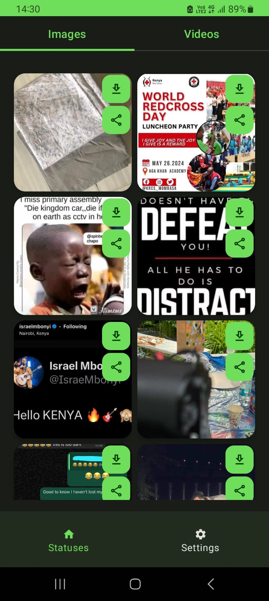
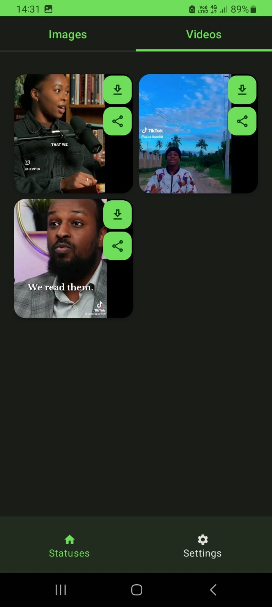
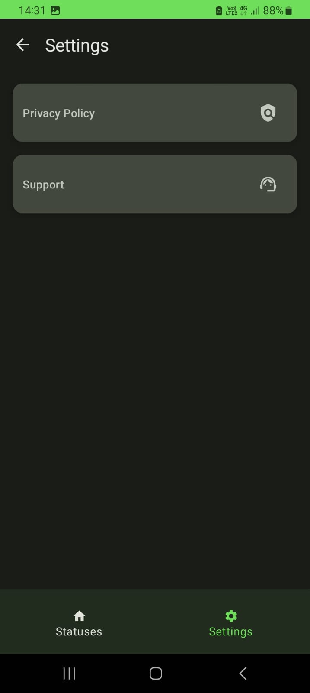

# Statuses Saver
An Android app to allow saving WhatsApp statuses i.e images and videos

<a href='https://play.google.com/store/apps/details?id=com.breens.whatsappstatussaver'></a>

## Demo
<p>



</p>

# Libraries
1. Coil
2. DataStore
3. Hilt
4. Navigation Compose
5. Splash Screen API
6. Firebase Analytics
7. Firebase Crashlytics
8. Accompanist Permissions
9. Lottie
10. Exoplayer

# License
```xml
Copyright 2024 BreensMbaka

    Licensed under the Apache License, Version 2.0 (the "License");
    you may not use this file except in compliance with the License.
    You may obtain a copy of the License at

    http://www.apache.org/licenses/LICENSE-2.0

    Unless required by applicable law or agreed to in writing, software
    distributed under the License is distributed on an "AS IS" BASIS,
    WITHOUT WARRANTIES OR CONDITIONS OF ANY KIND, either express or implied.
    See the License for the specific language governing permissions and
    limitations under the License.
```  
  